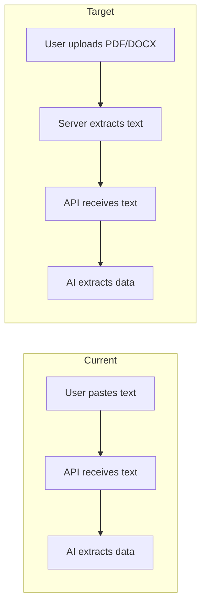

# Applivize PDF Upload & Extraction Implementation Plan

## Executive Summary

This plan adds PDF and DOCX file upload capabilities to the Applivize platform, enabling users to upload their CV/resume and job descriptions as files instead of pasting text.

### Recommended Approach
- **Server-side extraction** (more reliable, handles complex PDFs better)
- **10MB file size limit** (covers 99% of CVs/job descriptions)
- **Support both PDF and DOCX** (most common resume formats)

---

## Current State vs Target State



---

## Architecture Design

### System Flow

```mermaid
flowchart TD
    subgraph Frontend
        A[File Upload Component] --> B[FormData with files]
    end
    
    subgraph API Layer
        B --> C[/api/upload - File Handler]
        C --> D{File Type?}
        D -->|PDF| E[pdf-parse library]
        D -->|DOCX| F[mammoth library]
        E --> G[Extracted Text]
        F --> G
    end
    
    subgraph Processing
        G --> H[/api/analyze - Existing]
        H --> I[AI Data Extraction]
        I --> J[Scoring Logic]
        J --> K[Response]
    end
```

### File Processing Strategy

| Format | Library | Why This Choice |
|--------|---------|-----------------|
| PDF | `pdf-parse` | Lightweight, works in Node.js, handles most PDFs well |
| DOCX | `mammoth` | Clean text extraction, preserves structure |

---

## Implementation Tasks

### Phase 1: Backend - File Processing Library

#### Task 1.1: Install Dependencies
```bash
npm install pdf-parse mammoth
npm install -D @types/pdf-parse
```

#### Task 1.2: Create PDF/DOCX Parser Utility
**File:** `src/lib/file-parser.ts`

This utility will:
- Accept a file buffer and mime type
- Route to appropriate parser based on file type
- Return extracted plain text
- Handle errors gracefully

#### Task 1.3: Create File Upload API Route
**File:** `src/app/api/upload/route.ts`

This API will:
- Accept multipart/form-data with file uploads
- Validate file type (PDF, DOCX only)
- Validate file size (max 10MB)
- Extract text using the parser utility
- Return extracted text to frontend

---

### Phase 2: Backend - Integrate with Existing Analysis

#### Task 2.1: Update Analysis API
**File:** `src/app/api/analyze/route.ts`

Modify to accept either:
- Direct text (existing behavior)
- File references from upload API

#### Task 2.2: Create Combined Upload + Analyze Endpoint
**File:** `src/app/api/analyze-files/route.ts`

Single endpoint that:
- Accepts resume file + job description file
- Extracts text from both
- Runs existing analysis pipeline
- Returns full analysis response

---

### Phase 3: Frontend - File Upload UI

#### Task 3.1: Create FileUpload Component
**File:** `src/components/FileUpload.tsx`

Features:
- Drag and drop support
- Click to browse
- File type validation (PDF, DOCX)
- File size validation (10MB)
- Upload progress indicator
- Preview of selected file name

#### Task 3.2: Create Analysis Form Component
**File:** `src/components/AnalysisForm.tsx`

Features:
- Two file upload areas (Resume + Job Description)
- Option to paste text instead of upload
- Submit button with loading state
- Error handling display

#### Task 3.3: Create Results Display Component
**File:** `src/components/AnalysisResults.tsx`

Features:
- Score visualization
- Decision display (APPLY, IMPROVE, etc.)
- Missing skills list
- Breakdown by category

#### Task 3.4: Update Main Page
**File:** `src/app/page.tsx`

Replace default Next.js template with:
- Applivize branding/header
- Analysis form
- Results section

---

### Phase 4: Error Handling & Validation

#### Task 4.1: Create Validation Utilities
**File:** `src/utils/file-validation.ts`

- `validateFileType()` - Check MIME type
- `validateFileSize()` - Check against 10MB limit
- `sanitizeFilename()` - Security measure

#### Task 4.2: Create Error Types
**File:** `src/types/errors.ts`

Custom error types for:
- `FileTypeError`
- `FileSizeError`
- `ParseError`
- `ExtractionError`

---

### Phase 5: Testing & Polish

#### Task 5.1: Create Test Files
- Sample PDF resume
- Sample DOCX resume
- Sample PDF job description

#### Task 5.2: Add Loading States
- Skeleton loaders during file processing
- Progress indicators for large files

#### Task 5.3: Add Success/Error Toasts
- File upload success
- Analysis complete
- Error notifications

---

## File Structure After Implementation

```
src/
├── app/
│   ├── api/
│   │   ├── analyze/
│   │   │   └── route.ts          # Existing - minor updates
│   │   ├── analyze-files/
│   │   │   └── route.ts          # NEW - combined upload + analyze
│   │   └── upload/
│   │       └── route.ts          # NEW - file upload handler
│   └── page.tsx                  # UPDATE - new UI
├── components/
│   ├── FileUpload.tsx            # NEW
│   ├── AnalysisForm.tsx          # NEW
│   └── AnalysisResults.tsx       # NEW
├── lib/
│   ├── file-parser.ts            # NEW - PDF/DOCX parsing
│   ├── extract.ts                # Existing - no changes
│   └── ...
├── types/
│   ├── analysis.ts               # Existing - minor additions
│   └── errors.ts                 # NEW
└── utils/
    └── file-validation.ts        # NEW
```

---

## API Specifications

### POST /api/upload

**Request:**
```
Content-Type: multipart/form-data
Body: file (PDF or DOCX, max 10MB)
```

**Response:**
```json
{
  "success": true,
  "text": "Extracted text content...",
  "metadata": {
    "filename": "resume.pdf",
    "pages": 2,
    "wordCount": 450
  }
}
```

### POST /api/analyze-files

**Request:**
```
Content-Type: multipart/form-data
Body: 
  - resumeFile (PDF or DOCX)
  - jobDescriptionFile (PDF or DOCX)
```

**Response:**
```json
{
  "finalScore": 72,
  "decision": "APPLY_WITH_IMPROVEMENTS",
  "breakdown": {
    "skills": 25,
    "experience": 20,
    "eligibility": 15,
    "jobReality": 8,
    "competition": 4
  },
  "missingSkills": ["Kubernetes", "AWS"],
  "notes": ["Experience slightly below requirement."],
  "extractedData": {
    "candidate": { ... },
    "job": { ... }
  }
}
```

---

## Security Considerations

1. **File Type Validation**: Check both extension AND MIME type
2. **File Size Limit**: Enforce 10MB server-side
3. **Sanitize Filenames**: Prevent path traversal attacks
4. **No File Storage**: Process in memory, don't save to disk
5. **Rate Limiting**: Consider adding rate limits to prevent abuse

---

## Dependencies to Add

```json
{
  "dependencies": {
    "pdf-parse": "^1.1.1",
    "mammoth": "^1.6.0"
  },
  "devDependencies": {
    "@types/pdf-parse": "^1.1.4"
  }
}
```

---

## Implementation Order

1. **Backend First**: File parser + upload API
2. **Integration**: Connect to existing analysis
3. **Frontend**: UI components
4. **Polish**: Error handling, loading states

This order allows testing each layer independently.

---

## Questions for Review

1. Do you want to store analysis history in MongoDB?
2. Should users be able to save/download their analysis results?
3. Do you want to add user authentication later?

---

## Next Steps

Once you approve this plan, switch to **Code mode** to begin implementation starting with:
1. Installing dependencies
2. Creating `src/lib/file-parser.ts`
3. Creating `src/app/api/upload/route.ts`
